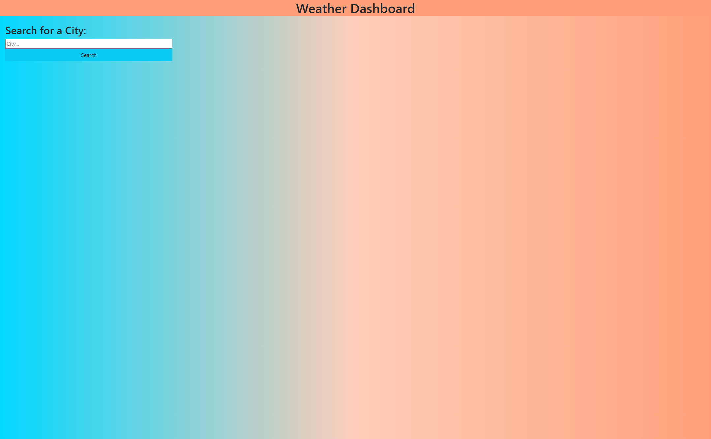

# Server-side-API-Weather-Dashboard
Weather dashboard for searching the weather outlook by location

## Description

Provide a short description explaining the what, why, and how of your project. Use the following questions as a guide:

A weather web application that allows users to see cities weather data. This application can be used for planning trips to other cities. This is done by allowing user to search a city name and displaying the current and five-day weather forecast.

## Installation

N/A

## Usage

Users can utilize this web application by entering a city name into the search bar and clicking search. The current weather data for the searched for city will then display as well as the five-day forecast.

Deployed URL: https://nick-jda.github.io/Server-side-API-Weather-Dashboard/

---